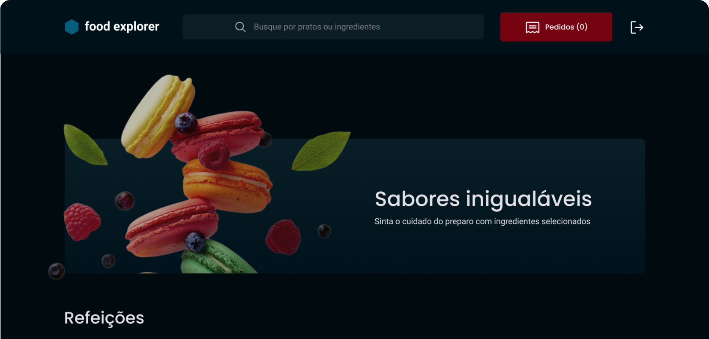

<h1 align="center"> Explorer Food </h1>

Front-end do projeto final do Explorer, essa aplicação passa um layout interativo, responsivo tanto em desktop como mobile.

  <a href="#-tecnologias">Tecnologias</a>&nbsp;&nbsp;&nbsp;|&nbsp;&nbsp;&nbsp;
  <a href="#-projeto">Projeto</a>&nbsp;&nbsp;&nbsp;|&nbsp;&nbsp;&nbsp;
  <a href="#-layout">Layout</a>&nbsp;&nbsp;&nbsp;|&nbsp;&nbsp;&nbsp;
  <a href="#memo-licença">Licença</a>

  

 

  

## 🚀 Tecnologias

Esse projeto foi desenvolvido com as seguintes tecnologias:

- Vite
- Axios
- ReactJS
- LocalStorage
- styled-components
- react-icons
- react-input-mask
- react-select
- react-router-dom
- JavaScript

## 🔖 Layout

Você pode visualizar o layout do projeto através [DESSE LINK](https://www.figma.com/file/NWgEV6M9oqTihubXjhwj71/food-explorer-v2-(Community)?type=design&node-id=201-1534&t=pKhn1ZnIwVY2Gjhc-0). É necessário ter conta no [Figma](https://figma.com) para acessá-lo.

## :memo: Licença

Esse projeto está sob a licença MIT.

---

Feito com ♥ by (https://www.linkedin.com/in/gustavo-martins-872373155/)
